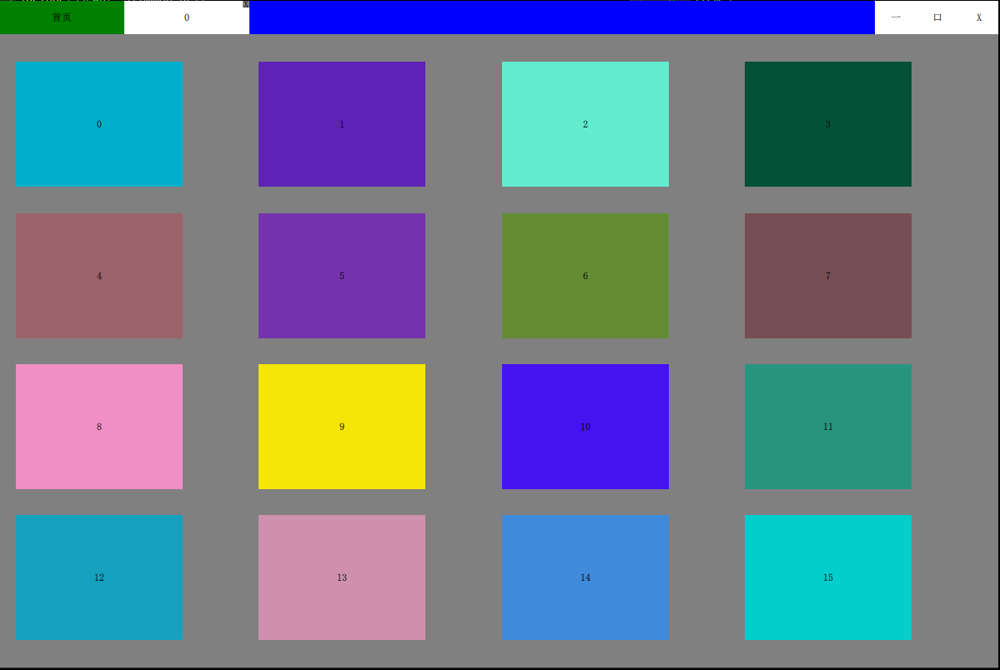

# 多进程Demo
 
类似于Chrome浏览器，多进程按照Tab的方式显示

（目前仅在windows平台使用）
## Build status
| [Windows][win-link] |
| :-----------------: |
| ![win-badge]        |

[win-badge]: https://ci.appveyor.com/api/projects/status/9i0y893u0d9ayud9?svg=true "AppVeyor build status"
[win-link]: https://ci.appveyor.com/project/jaredtao/mulitprocesstab "AppVeyor build status"

## License

## 预览图

主页

Tab页

## 说明

标题栏和首页，是主进程，每个tab页面，是一个独立的子进程。

子进程窗口通过Windows API  SetParent的方式，附加到主进程。

Tab切换，使用进程间通讯机制，将目标Tab的窗口置顶。

## 进程间通讯机制

使用Qt的LocalSocket功能。

主进程启动之后，创建一个LoaclServer，使用随机uuid作为server名称。

创建Tab时启动子进程，将server名称传递给子进程，子进程启动后，创建LoclaSocket来连接server。

## 开发环境

* Qt 5.9.x Windows
### 联系方式:

***

| 作者 | 涛哥                           |
| ---- | -------------------------------- |
| QQ、TIM   | 759378563                      |
| 微信 | xsd2410421                       |
| 邮箱 | jared2020@163.com                |
| blog | https://jaredtao.github.io/ |

***

QQ(TIM)、微信二维码

###### 请放心联系我，乐于提供咨询服务，也可洽谈有偿技术支持相关事宜。

***
#### **打赏**

###### 觉得分享的内容还不错, 就请作者喝杯奶茶吧~~
***

